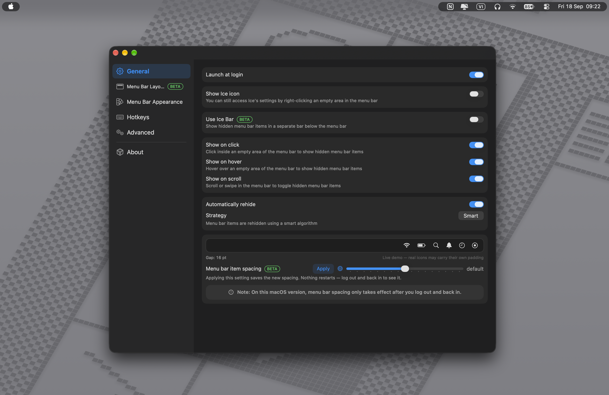
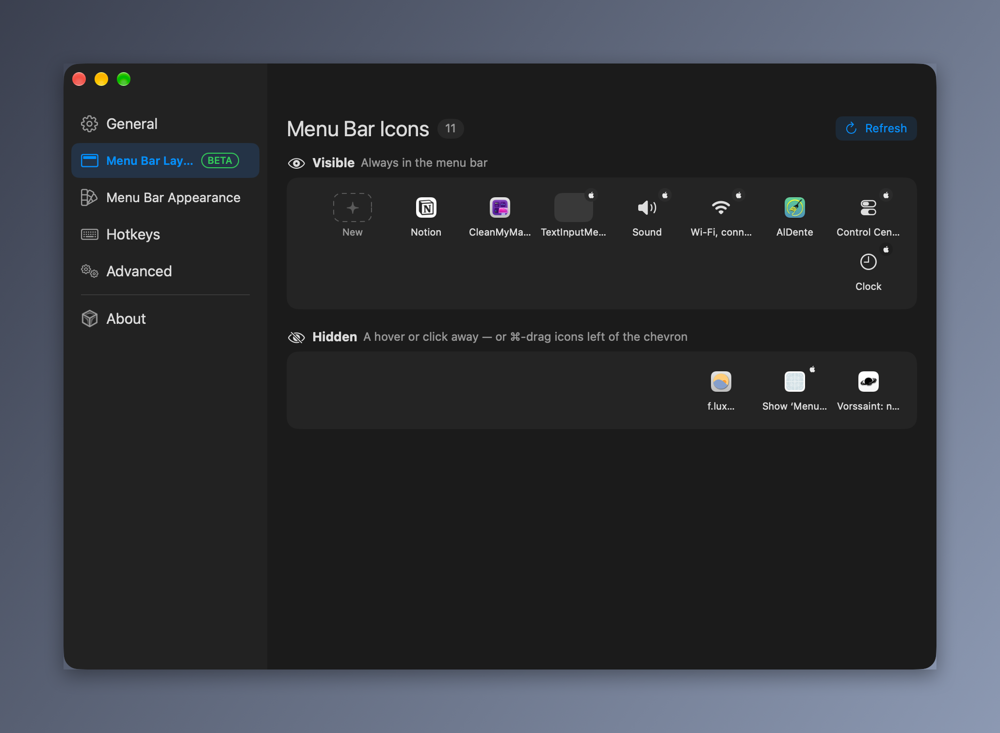
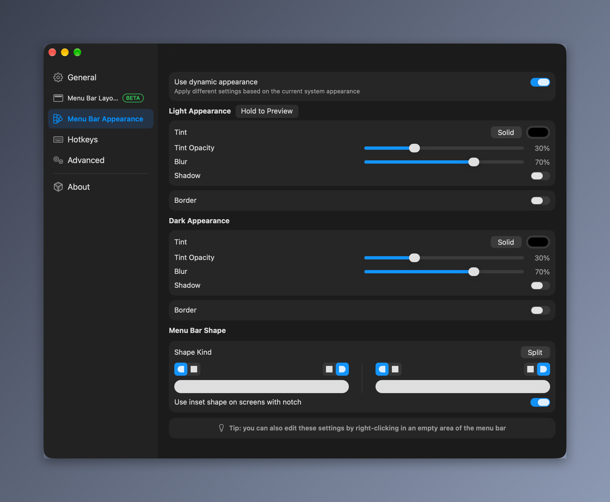

<div align="center">
    
    <h1>Ice — Free & Open-Source Menu Bar Manager for macOS</h1>
    <p>Hide and organize menu bar icons on your Mac. The best <strong>free Bartender alternative</strong> — also a great <strong>Hidden Bar</strong> and <strong>Vanilla alternative</strong> — focused on stability and a smooth, distraction-free experience.<br>✅ <strong>Fully supports macOS 27</strong></p>
</div>


<div align="center">

[](https://github.com/cavaldos/Ice/releases/latest)
[](https://github.com/cavaldos/Ice/releases)


[](https://github.com/cavaldos/Ice/stargazers)
[](https://github.com/cavaldos/Ice/network/members)
[](https://icemenubar.app)
[](LICENSE)
[](https://ko-fi.com/calvados)

<br>

<a href="https://ko-fi.com/calvados" target="_blank">
    
</a>

</div>

> [!NOTE]
> Ice is in active development. Grab the latest build from the [releases page](https://github.com/cavaldos/Ice/releases/latest).

> [!TIP]
> ✅ **Fully supports macOS 27** — tested and ready for the latest macOS, all the way back to macOS 14 Sonoma.

## Install

**Homebrew** (recommended — updates with `brew upgrade`):

```bash
brew tap cavaldos/tap
brew install cavaldos/tap/ice
```

**Manual:** download `Ice.zip` from the [latest release](https://github.com/cavaldos/Ice/releases/latest) and move the unzipped app into `/Applications`.

For local development, see [script/README.md](script/README.md).

## Uninstall

**Homebrew:**

```bash
brew uninstall --cask cavaldos/tap/ice
```


```bash
brew uninstall --cask --zap cavaldos/tap/ice
```

**Manual:** quit Ice, then drag `Ice.app` out of `/Applications` to the Trash. To also remove preferences, delete `~/Library/Preferences/com.jordanbaird.Ice.plist`.

## Why Ice?

Too many menu bar icons? On small MacBook screens — especially models with the notch — the menu bar fills up fast and icons get hidden behind the camera housing.

Ice lets you **hide menu bar icons on Mac, organize them into sections, and reveal them when you need them**. It is a **free and open-source Bartender alternative for macOS**, and a drop-in replacement if you are coming from **Hidden Bar, Vanilla, Dozer, or BarBee**.

| | Ice (this app) | Bartender 5 | Hidden Bar | Vanilla |
|---|---|---|---|---|
| Price | **Free, open-source (GPL-3.0)** | ~$16 paid | Free, open-source | Free / Pro paid |
| Hide & show menu bar icons | ✅ | ✅ | ✅ | ✅ |
| Always-hidden section | ✅ | ✅ | ❌ | ❌ |
| Second menu bar (Ice Bar) for notched Macs | ✅ | ✅ (Bartender Bar) | ❌ | ❌ |
| Menu bar themes (tint, border, shape) | ✅ | ✅ | ❌ | ❌ |
| Hotkeys | ✅ | ✅ | Limited | Pro only |
| macOS 27 support | ✅ **fully supported, tested** | ✅ | ⚠️ unmaintained | ✅ |

## Gallery

**Always-Hidden section demo — hide menu bar icons and reveal on hover**


**Show and hide menu bar icons demo**


**Fullscreen settings**




| Ice Bar — second menu bar for notched MacBooks                                                   | Drag-and-drop menu bar layout                                                                   |
| ------------------------------------------------------------------------------------------- | --------------------------------------------------------------------------------------------------- |
|  |  |

| Menu bar appearance and theme settings                                                                  | Menu bar item spacing                                                                                       |
| ------------------------------------------------------------------------------------------------------- | --------------------------------------------------------------------------------------------------------- |
|  |  |

## Permissions

Ice needs two grants in **System Settings > Privacy & Security**:

* **Accessibility** — hiding and moving menu bar items
* **Screen Recording** — menu bar item images and the Ice Bar

> [!IMPORTANT]
> **After every update you will need to grant these again.**
>
> Releases are ad-hoc signed, so the app's designated requirement is a pinned
> `cdhash` instead of a stable Developer ID. Each build has a different hash, so
> the requirement macOS recorded when you first granted access no longer matches
> the new binary. The symptom is confusing: System Settings still shows the
> toggle **on** while Ice behaves as though it were denied.
>
> The stale entries have to be cleared before the grant can be re-recorded:
>
> ```bash
> ./script/fix-permissions.sh
> ```
>
> Or by hand: quit Ice, run `tccutil reset Accessibility com.jordanbaird.Ice`
> and `tccutil reset ScreenCapture com.jordanbaird.Ice`, relaunch, re-grant.

Because the builds are ad-hoc signed rather than notarized, Gatekeeper may also refuse the first launch. Right-click the app and choose **Open**, or clear the quarantine flag with `xattr -d com.apple.quarantine /Applications/Ice.app`.

## Features

**Hide and organize menu bar icons**
Hide items individually or all at once, with an optional "always-hidden" section. Reveal hidden items by hovering, clicking an empty area, or scrolling — with auto-rehide, drag-and-drop reordering, and a separate Ice Bar for notched MacBooks.

**Ice Bar — a second menu bar for notched Macs**
On MacBooks with a camera notch, icons hidden behind the notch become unreachable. The Ice Bar gives hidden icons their own full-width menu bar below, so nothing is ever lost.

**Menu bar appearance and themes**
Custom menu bar tint (solid or gradient), shadow, border, and shape (rounded and/or split).

**Hotkeys**
Toggle hidden sections, the Ice Bar, divider icons, and application menus from the keyboard.

**Lightweight and private**
Launch at login, automatic updates. No account, no telemetry, no subscription — your settings stay on your Mac.

> ✅ **macOS 27 fully supported** — works on macOS 14 Sonoma and later, including Sequoia, Tahoe, and macOS 27. If you need a similar tool for macOS 13 Ventura or earlier, check out [Ice 0.11.x](https://github.com/jordanbaird/Ice/releases).

## Project Philosophy

Ice is built with a focus on **stability, performance, and a smooth user experience**.

Rather than adding features for the sake of having more features, the project prioritizes a small, focused, and reliable feature set. Every feature should have a clear purpose, integrate naturally with macOS, and maintain Ice's simplicity and performance.

Our goal is to make Ice feel fast, predictable, and unobtrusive — a tool that quietly does its job without unnecessary complexity. Ice will always remain **open-source** and **free**.

## Contributing

Contributions are welcome! Please read the [contribution guidelines](./Resources/document/CONTRIBUTING.md) before submitting a pull request.

## Support

<a href="https://ko-fi.com/calvados" target="_blank">
    
</a>

<a href="https://www.paypal.com/paypalme/nnkhanh29" target="_blank">
    
</a>

## Acknowledgments

A fork of [Ice](https://github.com/jordanbaird/Ice) by [Jordan Baird](https://github.com/jordanbaird) — huge thanks for the original work this project builds on.

## FAQ

**Is Ice free?**
Yes — free and open-source (GPL-3.0), no Pro tier or subscription.

**Is it a good Bartender / Hidden Bar / Vanilla replacement?**
Yes — hide/show icons, always-hidden section, Ice Bar for the notch, hotkeys and themes, free and actively maintained.

**How do I hide menu bar icons?**
Drag icons between Visible / Hidden / Always-Hidden in Menu Bar Layout, or right-click any icon. Hover or hotkey to reveal.

**Which macOS versions are supported?**
macOS 14 Sonoma and later — with **full, tested support for macOS 27**, plus Sequoia and Tahoe. For macOS 13 or earlier, use [Ice 0.11.x](https://github.com/jordanbaird/Ice/releases).

## License

[GPL-3.0](LICENSE) — Ice is and will always remain open-source and free.

## Star History

<a href="https://star-history.com/#cavaldos/Ice&Date">
    
</a>
