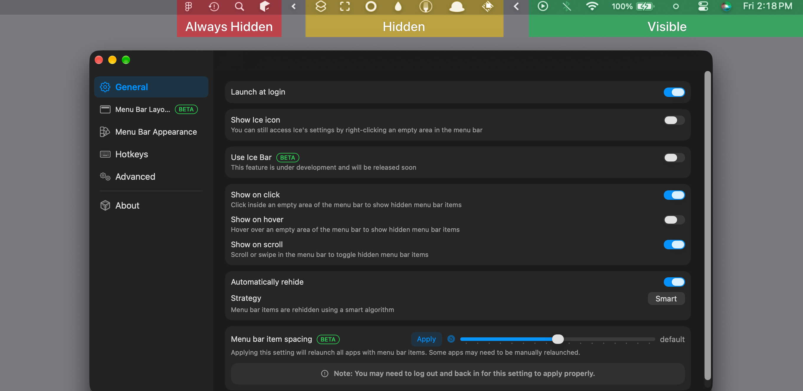

    
    <h1>Ice</h1>
    
A powerful, open-source menu bar manager for macOS, focused on stability and a smooth, distraction-free experience.

 

> [!NOTE]
> Ice is in active development. Grab the latest build from the [releases page](https://github.com/cavaldos/Ice/releases/latest).

## Install

Download `Ice.zip` from the [latest release](https://github.com/cavaldos/Ice/releases/latest) and move the unzipped app into `/Applications`.

For local development, see [script/README.md](script/README.md).

## Features

**Menu bar management**
Hide items individually or all at once, with an optional "always-hidden" section. Reveal hidden items by hovering, clicking an empty area, or scrolling — with auto-rehide, drag-and-drop reordering, and a separate Ice Bar for notched MacBooks.

**Appearance**
Custom menu bar tint (solid or gradient), shadow, border, and shape (rounded and/or split).

**Hotkeys**
Toggle sections, the Ice Bar, divider icons, and application menus from the keyboard.

**Other**
Launch at login, automatic updates.

> Requires macOS 14 or later — ready for macOS 27. If you need a similar tool for macOS 13 or earlier, check out [Ice 0.11.x](https://github.com/jordanbaird/Ice/releases).

## Project Philosophy

Ice is built with a focus on **stability, performance, and a smooth user experience**.

Rather than adding features for the sake of having more features, the project prioritizes a small, focused, and reliable feature set. Every feature should have a clear purpose, integrate naturally with macOS, and maintain Ice's simplicity and performance.

Our goal is to make Ice feel fast, predictable, and unobtrusive — a tool that quietly does its job without unnecessary complexity. Ice will always remain **open-source** and **free**.

## Gallery

**Demo Always Hidden**

**Demo**

| Ice Bar                                                                                     | Drag & drop layout                                                                                  |
| ------------------------------------------------------------------------------------------- | --------------------------------------------------------------------------------------------------- |
|  |  |

| Appearance settings                                                                                     | Item spacing                                                                                              |
| ------------------------------------------------------------------------------------------------------- | --------------------------------------------------------------------------------------------------------- |
|  |  |

## Contributing

Contributions are welcome! Please read the [contribution guidelines](./Resources/document/CONTRIBUTING.md) before submitting a pull request.

## Support

## Acknowledgments

A fork of [Ice](https://github.com/jordanbaird/Ice) by [Jordan Baird](https://github.com/jordanbaird) — huge thanks for the original work this project builds on.

## License

[GPL-3.0](LICENSE) — Ice is and will always remain open-source and free.

## Star History

